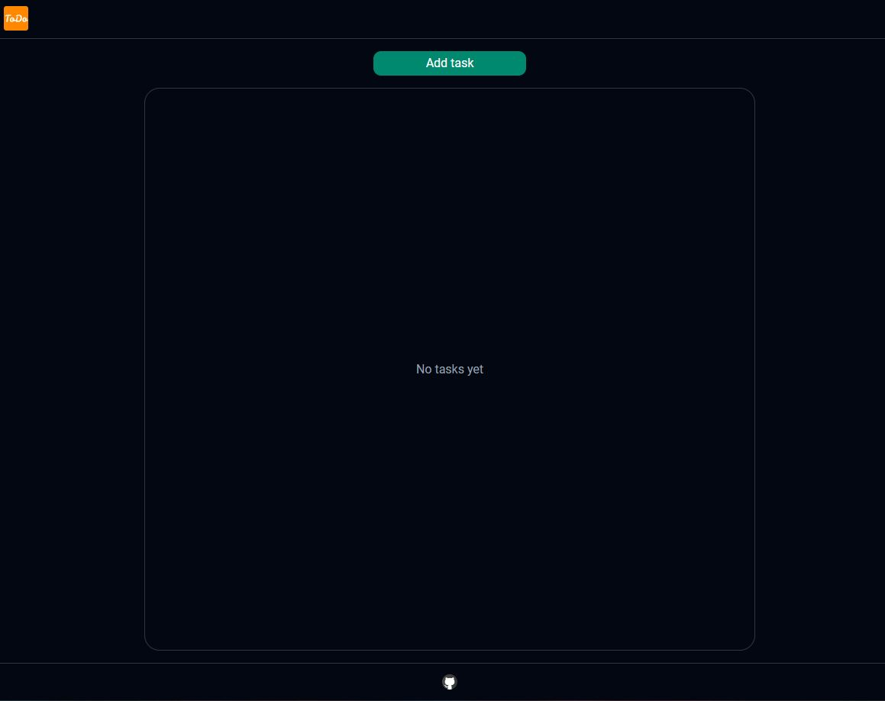
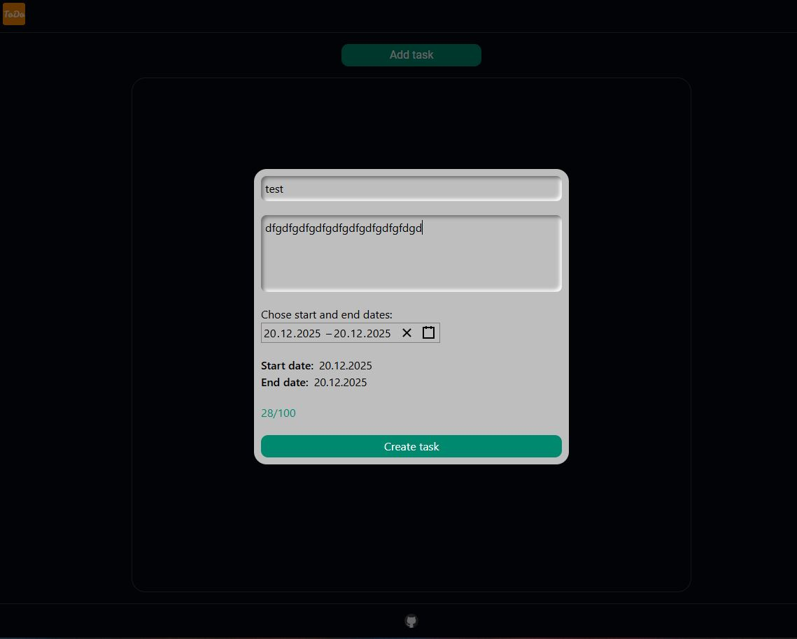
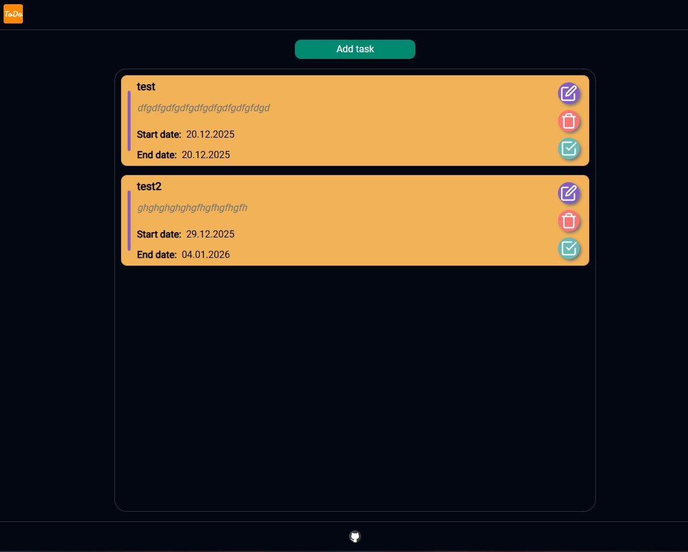

# REACT TODO LIST

В разных ветках репозитория будут применены разные стейт менеджеры: Redux, Zustand

## Установка

- выполнить команду `npm ci`

## Запуск

- запускается командой `npm run dev` и работает на <http://localhost:3000/>

